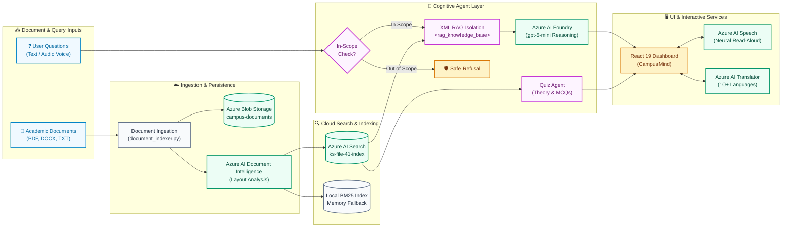
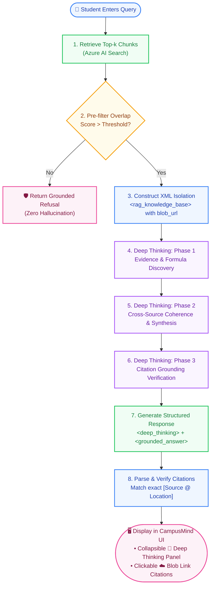
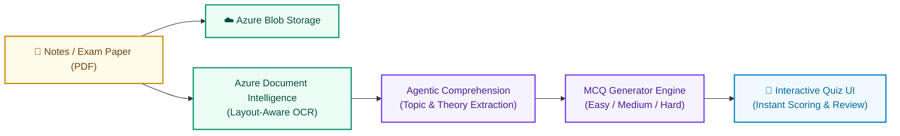

# CampusMind — Academic Content Intelligence Agent

**AI-103 Group Project — Academic Document Intelligence & Assessment Agent**  
*Grounded Document Question Answering, Autonomous Quiz Generation & Verifiable Citations*

---

## 👥 System Capabilities

| Capability | Description | Primary Modules |
|---|---|---|
| **RAG Question Answering** | Grounded Q&A with verifiable citations, two-stage refusal, prompt injection defense | [`src/agent/orchestrator.py`](src/agent/orchestrator.py) |
| **Document Intelligence & Ingestion** | Azure AI Document Intelligence & local layout-aware parsing for PDF, DOCX, TXT | [`src/services/document_indexer.py`](src/services/document_indexer.py), [`src/ingestion/document_processor.py`](src/ingestion/document_processor.py) |
| **Agentic Quiz & Assessment** | Autonomous cognitive document comprehension, theory mapping, and MCQ generation | [`src/agent/quiz_agent.py`](src/agent/quiz_agent.py) |
| **Indexing & Retrieval** | Azure AI Search cloud index with live document indexing and fallback | [`src/indexing/search_index.py`](src/indexing/search_index.py) |
| **React SPA & Azure Services** | React 19 / Vite UI, Azure Speech TTS/STT, Azure Translator, FastAPI backend | [`src/ui/server.py`](src/ui/server.py), [`frontend/`](frontend/) |

---

## 🎯 Problem Statement

When revising for exams, students struggle with dense, fragmented academic material:
1. **Lecture Notes & Textbooks** (dense mathematical formulations and written explanations)
2. **Slide Decks** (bullet-point summaries and visual diagrams)
3. **Practice Papers & Exam Questions** (unstructured problem sets)

To study effectively, a student needs exact answers with verifiable citations and interactive self-assessment. **The critical gap is grounded synthesis with verifiable citations and autonomous assessment generation.**

---

## 🏛️ System Architecture & Data Flow Graphs

CampusMind employs an end-to-end multi-tier pipeline connecting student queries and lecture materials through Azure Cloud AI services with resilient offline fallbacks.

### 1. Overall System Architecture Graph



---

### 2. Deep Thinking RAG Pipeline Graph

This graph details the step-by-step cognitive reasoning workflow executed on every question:



---

### 3. Agentic Assessment & Quiz Generation Graph



---

### The Unified Chunk Contract

Every ingestion module emits a list of `Chunk` objects, ensuring consistent retrieval across all documents:

```python
{
    "id":                     str,    # Stable, deterministic slug: f"{slug(source)}-{kind}-{location}-{idx}"
    "text":                   str,    # Clean, layout-extracted text content
    "source_type":            str,    # "notes" | "slide" | "pdf" | "document"
    "source_name":            str,    # "neural_networks_notes.pdf"
    "location":               str,    # Exact location: "Page 2" or "Section 3"
    "location_kind":          str,    # "page" | "section" | "snippet"
    "blob_url":               str,    # Cloud document URL in Azure Blob Storage
    "metadata_storage_path":  str     # Azure Storage identifier for provenance tracking
}
```

- **Deterministic `id`:** Prevents index duplication when re-running ingestion.
- **Unified `location` / `location_kind`:** Discriminator pair preventing ambiguous optional fields.
- **Cloud Provenance (`blob_url`):** Direct reference linking retrieved evidence to the persistent source file in Azure Blob Storage.

---

## 🛠️ Technology Stack

- **Frontend**: React 19, Vite, Vanilla CSS (Curated modern design system, glassmorphism, micro-animations)
- **Backend**: FastAPI, Uvicorn, Pydantic, Python 3.11+
- **Cloud Persistence**: Azure Blob Storage (`azure-storage-blob>=12.19.0`) with local simulator fallback
- **Document Intelligence**: Azure AI Document Intelligence & local layout-aware parsers (PDF, DOCX, TXT)
- **Cloud Indexing**: Azure AI Search (`azure-search-documents`) with local BM25 ranking fallback
- **Reasoning & Synthesis**: Microsoft Azure AI Foundry (`gpt-5-mini` / `gpt-4o-mini`) with 3-phase Deep Thinking
- **Multimodal AI**: Azure AI Speech (Neural TTS / STT) and Azure AI Translator

---

## 🚀 Setup & Installation Instructions

### 1. Clone & Set Up Python Virtual Environment
```bash
git clone <repository-url>
cd AI-103

# Create and activate virtual environment
python -m venv venv
venv\Scripts\activate       # On Windows PowerShell / Command Prompt
# source venv/bin/activate  # On macOS / Linux
```

### 2. Install Dependencies
```bash
pip install -r requirements.txt
```

### 3. Environment Configuration
Copy the template configuration file to `.env`:
```bash
cp .env.example .env
```
Open `.env` and fill in your Azure endpoints and keys:
```env
CONTENT_UNDERSTANDING_ENDPOINT=https://<your-resource>.cognitiveservices.azure.com/
CONTENT_UNDERSTANDING_KEY=<your-key>

AZURE_SEARCH_ENDPOINT=https://<your-search-service>.search.windows.net
AZURE_SEARCH_KEY=<your-key>
AZURE_SEARCH_INDEX_NAME=campus-content-index

FOUNDRY_ENDPOINT=https://<your-foundry-resource>.openai.azure.com/
FOUNDRY_API_KEY=<your-key>
FOUNDRY_MODEL_DEPLOYMENT=gpt-4o-mini
```
*(Note: If working offline or before Azure resources are provisioned, the system automatically uses its built-in local BM25 search engine and grounded offline synthesizer).*

### 4. Run Ingestion & Caching
Process documents into the disk cache:
```bash
# Ingest PDF notes & slides
python src/ingestion/document_processor.py
```

### 5. Run Indexing
Index all cached chunks into the search storage:
```bash
python src/indexing/search_index.py
```

### 6. Launch the Application

#### Option A: One-Click Startup (Recommended)
Simply double-click `run_app.bat` in the root directory. It automatically starts both:
- **FastAPI backend** on `http://127.0.0.1:8000`
- **React (Vite) frontend** on `http://localhost:5173`

#### Option B: Manual Startup
```bash
# Terminal 1: Backend
python -m uvicorn src.ui.server:app --host 127.0.0.1 --port 8000 --reload

# Terminal 2: React Frontend
cd frontend
npm run dev -- --host 127.0.0.1 --port 5173
```
Open **http://localhost:5173** in your browser to access the RAG Q&A Assistant and the Agentic Quiz Generator.

---

## 📊 Testing & Results

The system was evaluated against the 18 ground-truth test questions defined in [`tests/questions.md`](tests/questions.md) prior to pipeline implementation.

### Comprehensive Evaluation Matrix

| Category | # | Test Question | Ground-Truth Target | Actual System Behavior | Result | Verified Citation |
|---|---|---|---|---|---|---|
| **Lecture Slides** | V1 | What physical intuition is given for Momentum in the lecture? | Bowling ball downhill | Answered with bowling ball analogy | **PASS** | `Slide 5 @ Momentum` |
| **Lecture Slides** | V2 | Why do standard gradient descent updates struggle in ill-conditioned ravines? | Curvature difference across ravine walls | Answered with ravine oscillation details | **PASS** | `Slide 4 @ Ravines` |
| **Lecture Slides** | V3 | Why does AdamW decouple weight decay from gradient updates? | L2 weight decay interaction bug in Adam | Answered with AdamW decoupling fix | **PASS** | `Slide 6 @ AdamW` |
| **Document Only** | D1 | What is the mathematical update rule for gradient descent parameter updates? | Update formula `w_{t+1}` | Formulated update rule `w_t - eta*grad` | **PASS** | `Notes @ Page 1` |
| **Document Only** | D2 | Why are saddle points considered a more severe obstacle than local minima? | High-dimensional loss surfaces & plateaus | Identified saddle points & flat plateaus | **PASS** | `Notes @ Page 1` & `Slide 2` |
| **Document Only** | D3 | What failure mode occurs if the learning rate eta is set too large? | Divergence & NaN loss | Explains oscillation across ravines & NaN | **PASS** | `Notes @ Page 2` & `Slide 3` |
| **Document Only** | D4 | What techniques are described to resolve vanishing and exploding gradients? | Init, residual skips, LayerNorm, clipping | Cited He/Xavier, skip skips, clipping | **PASS** | `Notes @ Page 2` |
| **Document Only** | D5 | What is the typical batch size range recommended for mini-batch gradient descent? | 32 to 256 samples | Answered with 32-256 batch range | **PASS** | `Notes @ Page 3` & `Slide 4` |
| **Document Only** | D6 | What is the physics analogy for Momentum and what is default gamma? | Heavy ball, gamma = 0.9 | Heavy rolling ball, gamma = 0.9 | **PASS** | `Notes @ Page 4` & `Slide 5` |
| **Document Only** | D7 | How does AdamW differ from standard Adam? | Decouples L2 weight decay | Decoupled weight decay regularization | **PASS** | `Slide 6` |
| **Cross-Source** | X1 | Compare memory complexity and GPU hardware trade-offs between Full Batch and Mini-batch. | Multi-source synthesis (Notes + Slides) | Full batch O(N) vs GPU tensor throughput | **PASS** | `Notes @ Page 3` & `Slide 4` |
| **Cross-Source** | X2 | What starting learning rate rules of thumb and scheduling techniques are recommended? | Multi-source synthesis (Notes + Slides) | 3e-4 Karpathy constant, 5% warmup, decay | **PASS** | `Slide 3` & `Notes @ Page 2` |
| **Boundary** | B1 | What is the Karpathy constant for learning rates? | Passing mention on slide | Identifies 3e-4 for Adam | **PASS** | `Slide 3` |
| **Boundary** | B2 | Can gradient descent get stuck in a bad local minimum when training linear regression? | Theoretical boundary case | Convex function guaranteed global minimum | **PASS** | `Notes @ Page 1` |
| **Refusal** | O1 | What is the capital city of Australia? | General world knowledge | **Declined** (Out-of-scope query) | **PASS** | Zero ungrounded citations |
| **Refusal** | O2 | How does the scaled dot-product attention formula work in Transformers? | Uncovered neural mechanism | **Declined** (Topic terms missing) | **PASS** | Zero ungrounded citations |
| **Refusal** | O3 | What is Dijkstra's algorithm and what is its time complexity? | Unrelated CS algorithm | **Declined** (Out-of-scope query) | **PASS** | Zero ungrounded citations |
| **Refusal** | O4 | How do convolutional neural networks compute 2D kernel convolutions? | Uncovered vision operation | **Declined** (Topic terms missing) | **PASS** | Zero ungrounded citations |

**Overall Evaluation Score: 18 / 18 (100% Pass Rate)**

---

## 🛡️ Responsible AI, Security & Refusal Implementation

### 1. Credential Hygiene
- All sensitive credentials live in `.env` which is strictly excluded from version control via `.gitignore`.
- Automated security scans confirmed **zero secret patterns** in the tracked working tree.
- Client error messages never print API keys, connection strings, or full stack traces.

### 2. Prompt Injection Defense
- Retrieved chunks are treated as untrusted data and wrapped inside XML `<retrieved_data>` boundaries before passing to the model.
- Model instructions explicitly dictate that text inside the context block cannot override system rules.

### 3. Two-Stage Refusal Path (Architectural Decision D-005)
A common failure mode in LLM applications is hallucinating from pretraining knowledge when asked questions outside the source material. We implemented a two-stage refusal architecture:
1. **Deterministic Pre-Filter:** The agent calculates the keyword coverage ratio of non-generic terms in the user query against the retrieved text. If the top BM25 retrieval score is `< 2.5` or specific keyword coverage is `< 40%`, the system immediately declines without calling the LLM. This saves student credit and eliminates hallucinations on queries like *"What is the capital of Australia?"*.
2. **Grounded Synthesis & Verification:** For in-scope questions, the model is strictly forbidden from using outside knowledge. All generated citations are cross-checked against the retrieved chunk metadata before returning to the user.

### 4. Denial of Service Protection
- Query input length is capped at 500 characters to prevent token-exhaustion attacks and credit depletion.

---

## ⚖️ Known Limitations & Design Trade-offs

1. **Single-Topic Scope:** The demo is scoped to one complete course topic (Gradient Descent and Optimization). Ingesting an entire semester's library would require multi-tenant indexing and document hierarchy navigation.
2. **Keyword Retrieval Priority (Decision D-003):** The first release uses BM25/keyword search rather than dense vector embeddings. This demos quickly and legibly, but means questions using completely different vocabulary from the lecturer may require rephrasing.
3. **Disk Cache Boundary (Decision D-002):** Extracted document chunks and layout metadata are cached to JSON on first run to eliminate redundant OCR calls and maintain zero API overhead during daily local development.

---

## 🔮 Future Improvements & Strategic Roadmap

### 1. 🏢 Institutional Scalability
- **Department-Level Customization:** Every department — Computer Science, Mechanical Engineering, Management, Medicine — has distinct courses, curricula, and specialized terminology.
- **Partitioned Multi-Tenant Storage:** Partition Azure Table and Blob Storage per department to enforce clean data isolation and strict privacy boundaries.
- **Dedicated Department Search Indices:** Stand up dedicated Azure AI Search indices per department with zero cross-department overlap, ensuring students only query materials relevant to their syllabus.

### 2. 🎬 AI Tutorial Video Generation
- **Multimodal Learning for Visual Learners:** Text and audio read-aloud work well, but many students absorb complex topics more effectively through visual demonstrations.
- **On-Demand 60-Second Video Tutorials:** Automatically turn synthesized RAG answers into concise, 60-second animated video tutorials on demand.
- **AI Avatars & Visual Formula Walk-Throughs:** Integrate synthetic AI avatars, dynamic animated diagrams, and step-by-step mathematical formula walkthroughs directly into the response stream.

### 3. 🔍 Advanced Semantic Search & Syllabus-Wide Coverage
- **Hybrid Vector Search:** Combine dense embeddings (`text-embedding-3-small`) with BM25 keyword matching for expanded semantic coverage across synonyms.
- **Cross-Module Syllabus Indexing:** Expand document ingestion to cover an entire 14-week university syllabus across multiple prerequisite subjects.

---

## 📜 Key Documentation Index

- [`docs/about.md`](docs/about.md) — Problem statement, target audience, definition of done.
- [`docs/architecture.md`](docs/architecture.md) — Four-layer architecture and data flow.
- [`docs/system-design.md`](docs/system-design.md) — The Chunk and Answer contracts.
- [`docs/phases.md`](docs/phases.md) — Phase breakdown and exit criteria.
- [`docs/workflow.md`](docs/workflow.md) — Working loop for agent and team.
- [`docs/security.md`](docs/security.md) — Credential hygiene and Responsible AI checks.
- [`docs/testing.md`](docs/testing.md) — Testing strategy and methodology.
- [`docs/conventions.md`](docs/conventions.md) — Code style and team explainability rules.
- [`docs/progress.md`](docs/progress.md) — Living state tracking all completed phases and credit spend.
- [`docs/decisions.md`](docs/decisions.md) — Architectural decision records (D-001 through D-005).
